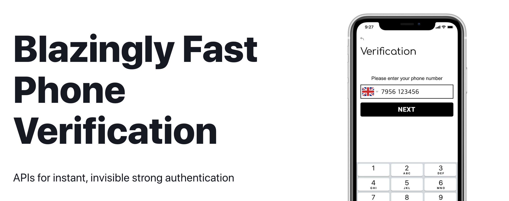

# Trusdk

iOS SDK for tru.id: Blazingly fast phone verification. Exposes APIs for instant, invisible strong authentication.

[![Swift Version][swift-image]][swift-url]
[![License][license-image]][license-url]




## Installation

Add this project on your `Package.swift`

```swift
import PackageDescription

let package = Package(
    dependencies: [
        .Package(url: "https://github.com/tbc", majorVersion: 0, minor: 0)
    ]
)
```

## Usage example


```swift
import Trusdk
let truSdk: TruSdk = TruSdk()
truSdk.openCheckUrl(url: url, completion: completion)
```

## Release History

* 0.0.1
    * Work in progress

## Meta

Distributed under the MIT license. See ``LICENSE`` for more information.

[https://github.com/yourname/github-link](https://github.com/dbader/)

[swift-image]:https://img.shields.io/badge/swift-5.0-green.svg
[swift-url]: https://swift.org/
[license-image]: https://img.shields.io/badge/License-MIT-blue.svg
[license-url]: LICENSE